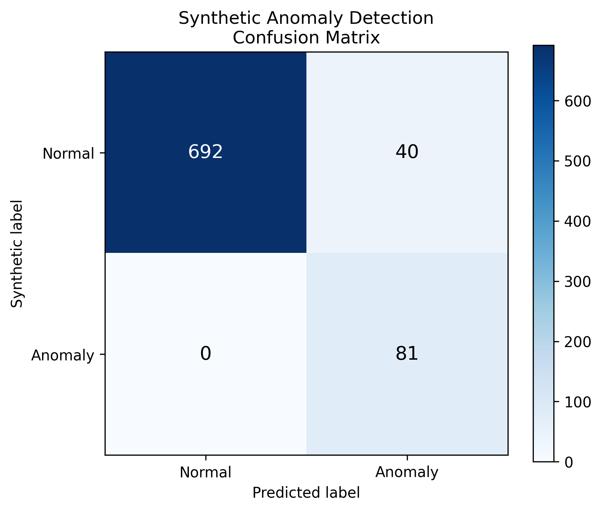

# LoRaWAN Traffic Anomaly Detection

A beginner-friendly machine learning project for analysing LoRaWAN network traffic and detecting anomalous behaviour.

## Project goals

- Explore LoRaWAN network traffic data
- Parse raw gateway event files
- Identify useful traffic features
- Visualise traffic patterns
- Build a simple baseline machine learning model
- Evaluate and interpret the detected anomalies

## Traffic features

The following traffic features were initially considered:

- Packet size
- Inter-arrival time
- Flow duration
- Number of packets
- Packet rate
- Retransmissions

After inspecting the available LoRaWAN gateway logs, the first version of the project focuses on the following features:

- **RSSI (Received Signal Strength Indicator):** Measures the strength of the signal received by the gateway. Unusual changes may indicate interference, movement, or changes in the communication environment.

- **SNR (Signal-to-Noise Ratio):** Describes the quality of the received signal relative to background noise. Sudden changes may indicate degraded or unusual radio conditions.

- **Payload size:** Represents the number of bytes carried by an uplink. Changes in payload size may reveal changes in traffic behaviour even when the payload content is encrypted.

- **Inter-arrival time:** Measures the time between consecutive uplink observations within the same temporally segmented DevAddr group. Unexpected bursts or long silent periods may represent unusual behaviour.

- **Frame counter gap:** Measures the difference between consecutive LoRaWAN frame counters. Zero, negative, or unusually large gaps may require further investigation.

- **Possible retransmission or frame counter reuse:** An unchanged frame counter may indicate a retransmission, but it may also result from counter reuse or an observation-ordering issue.

- **Missing frame counters:** A forward jump in the frame counter indicates that some counter values were not observed. This does not necessarily prove packet loss because the missing messages may be outside the captured data interval.

These features are behavioural indicators. None of them independently proves that an anomaly or attack occurred.

## Project structure

The project is organised as follows:

```text
lorawan-traffic-anomaly-detection/
├── data/
│   ├── raw/
│   └── processed/
├── results/
├── src/
│   ├── parse_lorawan_events.py
│   ├── build_features.py
│   ├── visualize_features.py
│   ├── prepare_ml_data.py
│   ├── train_isolation_forest.py
│   └── evaluate_synthetic_anomalies.py
└── README.md
```

- `data/raw/` contains the original TXT files collected from the LoRaWAN gateways.
- `data/processed/` contains generated parsing, feature-engineering, modelling, and anomaly-result datasets.
- `results/` contains parsing logs and generated exploratory visualisations.
- `src/parse_lorawan_events.py` extracts relevant LoRaWAN uplink information from the raw gateway events.
- `src/build_features.py` creates approximate temporal segments and calculates behavioural features.
- `src/visualize_features.py` visualises feature distributions, segment lengths, and correlations.
- `src/prepare_ml_data.py` selects complete modelling features while retaining identifiers as metadata.
- `src/train_isolation_forest.py` scales the selected features and applies the baseline Isolation Forest model.
- `src/evaluate_synthetic_anomalies.py` creates a temporal train-test split, injects controlled synthetic anomalies into the testing set, trains an Isolation Forest on historical observations, and reports precision, recall, F1-score, and unchanged observations flagged as anomalous.
- `README.md` documents the project workflow, methodological decisions, results, and limitations.

## Data parsing

Raw LoRaWAN gateway events are processed using `src/parse_lorawan_events.py`.

The parser:

- Reads the raw TXT files line by line
- Parses each line as a JSON event
- Extracts LoRaWAN uplink reception events
- Separates data uplinks from join requests
- Ignores unrelated event types
- Records malformed JSON lines in an error log
- Saves the extracted fields in `data/processed/uplinks.csv`

The parser does not detect anomalies. Its purpose is to transform raw gateway events into a structured dataset for further analysis.

### Parsing results

| Item | Count |
|---|---:|
| Input files | 1,421 |
| Total lines | 47,047 |
| Uplink events | 13,995 |
| Data uplinks | 12,853 |
| Join requests | 1,142 |
| Ignored events | 33,052 |
| Malformed lines | 0 |

The parser successfully processed all input files without encountering malformed JSON lines. The resulting structured dataset was saved to `data/processed/uplinks.csv`.

## DevAddr grouping and temporal segmentation

Ordinary LoRaWAN data uplinks in the available dataset do not contain DevEUI. Therefore, the permanent identity of a physical device cannot be determined from these records.

DevAddr is used only to group potentially related observations. It is not treated as a permanent device identifier because:

- A device may receive a new DevAddr after joining a new session.
- The same DevAddr may be reused in different sessions.
- Different devices may use the same DevAddr at different times.

To reduce the risk of comparing observations from separate capture periods, each DevAddr group is divided into temporal segments.

A new temporal segment begins when:

- An observation is the first occurrence of a DevAddr.
- The time since the previous observation with the same DevAddr is greater than 12 hours.

The 12-hour threshold was selected after examining the time-gap distribution. The median time gap was approximately 1.6 hours, while the 75th percentile increased to approximately 20.5 hours, indicating a separation between shorter behavioural sequences and long capture gaps.

| Item | Count |
|---|---:|
| Data uplinks | 12,853 |
| Unique DevAddr values | 8,840 |
| Temporal segments | 10,071 |
| Within-segment temporal comparisons | 2,782 |

These temporal segments do not represent verified LoRaWAN sessions or physical devices. They are used only to prevent behavioural features from being calculated across long periods of inactivity.

## Feature engineering

Feature engineering is performed using `src/build_features.py`.

The script:

1. Keeps ordinary data uplinks.
2. Removes observations without a valid timestamp or DevAddr.
3. Treats implausibly high RSSI measurements above -20 dBm as missing.
4. Sorts observations by `dev_addr` and `event_time`.
5. Divides each DevAddr group into 12-hour temporal segments.
6. Assigns a generated `session_id` to each segment.
7. Calculates behavioural changes only within the same segment.
8. Saves the generated features to `data/processed/features.csv`.

The generated `session_id` does not represent a verified LoRaWAN
session or a physical device. It is only an internal identifier for a
temporally segmented group of observations.

Eleven RSSI measurements above -20 dBm were considered implausible or
not directly comparable with the remaining measurements. These values
were treated as missing rather than deleting their complete observations.

### Generated features

| Feature | Description |
|---|---|
| `inter_arrival_time` | Time in seconds since the previous observation in the same temporal segment |
| `log_inter_arrival_time` | Log-transformed inter-arrival time used to reduce the influence of large time gaps |
| `rssi_change` | Difference between the current and previous RSSI values |
| `snr_change` | Difference between the current and previous SNR values |
| `payload_size_change` | Difference between the current and previous payload sizes |
| `f_cnt_gap` | Difference between the current and previous frame counters |
| `counter_reset_or_wrap` | Indicates a negative frame-counter difference within a temporal segment |
| `retransmission_or_reuse` | Indicates that the frame counter has not changed |
| `missing_counter_count` | Number of skipped counter values in a forward sequence |
| `log_missing_counter_count` | Log-transformed number of skipped counter values |
| `possible_packet_loss` | Indicates that one or more frame-counter values were not observed |

A missing frame-counter value does not necessarily prove that a packet was lost during radio transmission. The missing message may be outside the captured data interval. Therefore, `possible_packet_loss` is interpreted only as a missing-counter indicator.

### Feature engineering results

The feature engineering script produced 12,853 rows and divided the observations into 10,071 temporally segmented DevAddr groups.

| Feature | Rows where the feature could be calculated |
|---|---:|
| `inter_arrival_time` | 2,782 |
| `log_inter_arrival_time` | 2,782 |
| `rssi_change` | 2,782 |
| `snr_change` | 2,733 |
| `payload_size_change` | 2,782 |
| `f_cnt_gap` | 2,745 |
| `missing_counter_count` | 2,745 |

The first observation in each temporal segment does not have a previous observation in the same segment. Therefore, change-based features cannot be calculated for the first row of each segment:

`12,853 total observations - 10,071 segment-starting observations = 2,782 comparisons`

The number of available SNR and frame-counter features is slightly lower because some original observations do not contain SNR or FCnt values.

After removing rows with missing values in the core modelling features, 2,708 observations remain available for machine learning.

The dataset contains 80 negative frame-counter gaps and 243 zero frame-counter gaps within the temporal segments. These observations are preserved because they may contain useful behavioural information.

A negative frame-counter gap may indicate a counter reset, wraparound, out-of-order observation, or DevAddr reuse. A zero gap may indicate a retransmission or frame-counter reuse. These conditions are treated as indicators rather than confirmed anomalies.

## Current limitations

- The dataset does not contain ground-truth anomaly labels.
- The number of physical devices cannot be determined because DevEUI is absent from ordinary data uplinks.
- DevAddr is not a permanent device identifier.
- The generated temporal segments are not verified LoRaWAN sessions.
- The 12-hour segmentation threshold is an empirical project assumption.
- A frame-counter gap does not necessarily indicate actual packet loss.
- Retransmission cannot be reliably distinguished from frame-counter reuse.
- Most temporal segments contain only one observation and cannot produce change-based features.

## Baseline anomaly detection

A baseline unsupervised anomaly-detection model is implemented in
`src/train_isolation_forest.py`.

The model uses Isolation Forest because the dataset does not contain
verified normal or anomalous labels. Before training, the selected
features are scaled using `RobustScaler` to reduce the influence of
different numeric ranges and extreme values.

The selected modelling features are:

- RSSI
- SNR
- Payload size
- Log-transformed inter-arrival time
- Payload-size change
- Counter-decrease indicator
- Log-transformed counter-decrease magnitude
- Frame-counter reuse indicator
- Log-transformed missing-counter count
- Gateway-change indicator

RSSI and SNR changes are not included in the baseline model because
60.39% of consecutive within-segment observations were received by
different gateways. Radio measurements from different gateways are not
directly comparable.

The model uses a contamination value of 0.05. This is an initial
assumption that approximately 5% of the modelling observations may be
unusual; it is not an estimate derived from verified anomaly labels.

### Baseline results

| Item | Count |
|---|---:|
| Observations used by the model | 2,708 |
| Observations marked as unusual | 136 |
| Marked percentage | 5.02% |

The most unusual observations frequently contain large frame-counter
decreases combined with payload-size changes, unusual timing, or a
gateway transition.

These results represent statistical outliers rather than confirmed
attacks, device failures, counter resets, or verified LoRaWAN sessions.
Permanent device identity cannot be established because DevEUI is not
available in ordinary data uplinks.

## Synthetic-anomaly evaluation

The real LoRaWAN dataset does not contain verified normal or attack
labels. Therefore, the baseline Isolation Forest results cannot be
evaluated against real ground truth using precision, recall, or F1-score.

To support controlled evaluation and demonstrate the machine-learning
workflow, `src/evaluate_synthetic_anomalies.py` prepares a separate
educational experiment using synthetic anomalies.

### Temporal train-test split

The modelling observations are ordered chronologically and divided into:

| Dataset | Observations | Percentage |
|---|---:|---:|
| Training set | 1,895 | 70% |
| Testing set | 813 | 30% |

The training set contains the older observations, while the testing set
contains the newer observations. There is no temporal overlap between
the two sets.

This temporal split represents a scenario in which a model learns from
past observations and is subsequently applied to future traffic.

### Preprocessing

The same ten modelling features used by the baseline model are selected
for both datasets.

`RobustScaler` is fitted only on the training data. It learns the median
and interquartile range of each feature from the training set. The same
learned transformation is then applied to the testing set.

This prevents future testing observations from influencing the
preprocessing of the training data.

### Controlled anomaly injection

Synthetic anomalies are injected into 10% of the testing observations.
Using a fixed random seed results in 81 reproducibly selected test rows.

The injected observations contain a controlled combination of:

- an increased inter-arrival time;
- a substantial payload-size change;
- an active frame-counter decrease indicator;
- an increased frame-counter decrease magnitude.

The modified observations receive `synthetic_label = 1`, while unchanged
testing observations receive `synthetic_label = 0`.

These labels indicate whether a controlled modification was introduced;
they do not represent verified LoRaWAN attacks. Unchanged observations
are used as an experimental baseline but are not guaranteed to be truly
normal.

### Educational evaluation results

An Isolation Forest containing 200 estimators was fitted only on the
historical training observations. The fitted model was then applied to
the testing set containing the controlled synthetic anomalies.

| Result | Count |
|---|---:|
| True negatives | 692 |
| False positives | 40 |
| False negatives | 0 |
| True positives | 81 |
| Total predicted anomalies | 121 |
| False-positive rate | 0.055 |

The evaluation script also saves the metrics and confusion matrix to:

- `results/synthetic_evaluation_metrics.csv`
- `results/synthetic_confusion_matrix.png`



The resulting evaluation metrics were:

| Metric | Value |
|---|---:|
| Precision | 0.669 |
| Recall | 1.000 |
| F1-score | 0.802 |

The model identified all 81 injected synthetic anomalies. It also
flagged 40 unchanged testing observations.

The unchanged flagged observations frequently contained large frame-
counter decreases, long inter-arrival times, and gateway transitions.
Therefore, these observations may be natural statistical outliers rather
than confirmed false alarms.

These results measure the detection of strong controlled modifications.
They do not represent performance on verified real-world attacks.
Furthermore, unchanged testing observations are not guaranteed to be
truly normal because the original dataset does not contain ground-truth
labels.

### Contamination sensitivity analysis

The `contamination` parameter determines the decision threshold using
the specified proportion of the most unusual training observations. It
does not determine how many testing observations must be classified as
anomalous.

To examine the effect of this assumption, the synthetic evaluation was
repeated with contamination values of 0.01, 0.03, 0.05, 0.07, and 0.10.
All experiments used the same temporal train-test split, synthetic
anomaly indices, feature modifications, scaler, estimator count, and
random seed. Only the contamination value was changed.

| Contamination | TP | FP | FN | TN | Precision | Recall | F1-score | False-positive rate |
|---:|---:|---:|---:|---:|---:|---:|---:|---:|
| 0.01 | 81 | 3 | 0 | 729 | 0.964 | 1.000 | 0.982 | 0.004 |
| 0.03 | 81 | 25 | 0 | 707 | 0.764 | 1.000 | 0.866 | 0.034 |
| 0.05 | 81 | 40 | 0 | 692 | 0.669 | 1.000 | 0.802 | 0.055 |
| 0.07 | 81 | 51 | 0 | 681 | 0.614 | 1.000 | 0.761 | 0.070 |
| 0.10 | 81 | 72 | 0 | 660 | 0.529 | 1.000 | 0.692 | 0.098 |

All five configurations detected the 81 strong synthetic anomalies.
Increasing contamination moved the decision threshold so that more
unchanged testing observations were also classified as anomalous. This
increased the false-positive rate and reduced precision and F1-score.

A contamination value of 0.01 produced the strongest result in this
controlled experiment. However, this does not establish 0.01 as the
optimal value for real LoRaWAN traffic. The injected modifications were
deliberately strong, and the original dataset does not contain verified
normal or attack labels.

The complete analysis can be reproduced with:

```bash
python src/run_contamination_sensitivity.py
